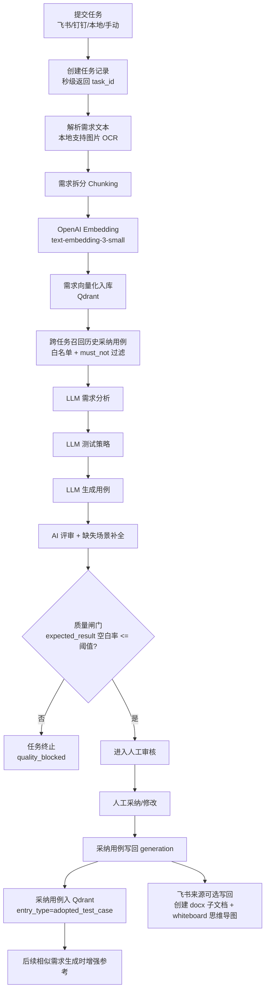

# AI Test Platform

AI 测试用例生成平台：支持飞书/钉钉文档、本地文件（含图片 OCR）、手动输入，完成需求分析 → 用例生成 → 用例评审 → 人工采纳 → 经验沉淀（向量库）全流程。

## 本次版本改动总览（2026-04-22 第四轮 · QA Skills 工程化加固）

> 主题：在第三轮 13 项增强的基础上做"工程化加固"——启动健康检查、真实 token 回填、独立审计表、Skill 依赖注入、Few-shot 智能选择、Discover 联合路由、Golden 回归、CLI 工具、前端可观测面板，共 **9 项二阶优化** 全部交付。

### 一、本轮新增能力一览

| # | 能力 | 关键模块 | 价值 |
|---|------|---------|------|
| R1 | **启动健康检查 + /health 接口** | `skills/health.py` + `core/event.py` + `/api/ai/skills/health` | 启动时遍历所有 skill 校验 `SKILL.md` / `description` / `primary_prompt` 长度 / semver / 角色映射有效性；支持 `QA_SKILL_HEALTH_STRICT=true` 失败直接 fail-fast |
| R2 | **真实 Token 回填** | `llm.py` (`last_usage_ctx`) + `ai.py` (`_backfill_actual_tokens`) | 每次 LLM 调用后用 `response.usage.prompt_tokens / completion_tokens` 覆盖估算值，便于真实成本核算 |
| R3 | **独立审计表 SQLite** | `skills/audit.py` (`init_audit_storage`/`query_persisted`/`get_token_usage_stats`) + `event.py` 启动建表 | 落库到 `skill_audits` 表，支持分页查询、按 role/skill/task 过滤、聚合统计、CSV 导出 |
| R4 | **Skill 依赖注入** | `loader.py` (`requires` + 递归加载) + `builder.py` 拼装 | `SKILL.md` frontmatter 增加 `requires: [other-skill]`，加载主 skill 时自动注入依赖的 `primary_prompt` 作为辅助 system 段，环检测保护 |
| R5 | **Few-shot 智能选择** | `builder._pick_example_for_role` | 不再固定取第一个示例：按 (kind 匹配, 与需求关键词重合, 长度接近 60% max_chars) 综合评分，提升示例相关性 |
| R6 | **Discover 联合路由** | `skills/discover.py` (`route_combined` + `route_by_skill_tags`) | 关键词规则 + 中英文双语 + library 中 skill `tags` 加权，规则未命中时回退到 tags 评分；新增 candidates 列表便于调试 |
| R7 | **Golden 回归测试** | `tests/test_skills_golden.py` (28 断言) | 固定输入 → 关键 system prompt 段必须出现 + token 区间合规 + health 必须通过；可加入 CI |
| R8 | **CLI 工具** | `scripts/skills_cli.py` | `list / validate / show / diff / audit / audit-export / route` 一应俱全，零依赖跑通 |
| R9 | **前端可观测面板** | `views/SkillsCenter.vue` 增加 `健康检查` `Token 统计` 两个 tab | 直接看每个 skill 的 issues/warnings；按 role/skill 维度看真实 token 累计、超预算次数、few-shot 命中率 |

### 二、新增 / 增强的 API

```
GET    /api/ai/skills/health              # 启动级健康检查（SKILL.md 合法性 + 角色映射有效性）
GET    /api/ai/skills/audit/persisted     # 持久化审计分页查询（limit/offset/role/task_id/skill_id）
GET    /api/ai/skills/audit/stats         # 按 role/skill 聚合（calls/tokens/fewshot 命中）
POST   /api/ai/skills/discover            # 升级为联合路由（关键词 + skill tags）
```

### 三、新增配置（`backend/.env`）

```bash
QA_SKILL_HEALTH_STRICT=false      # 启动健康检查失败是否 fail-fast（生产建议 true）
QA_SKILL_AUDIT_PERSIST=true       # 是否落库到 skill_audits SQLite 表
```

### 四、SKILL.md frontmatter 新增字段

```yaml
---
name: xxx
description: xxx
version: 1.0.0
lang: zh
tags: [api, generation]
requires: [discover-testing]   # 新增：会自动加载并把 primary_prompt 拼入 system
---
```

### 五、CLI 用法速查

```bash
# 列出所有 skill（id/版本/语种/资源数/hash）
python backend/scripts/skills_cli.py list

# 启动健康检查（同 /api/ai/skills/health）
python backend/scripts/skills_cli.py validate

# 查看单个 skill 详情
python backend/scripts/skills_cli.py show testcase-writer-plus

# 对比当前 skill 与外部 awesome-qa-skills 仓库的差异
python backend/scripts/skills_cli.py diff testcase-writer-plus ~/repos/awesome-qa-skills/testcase-writer-plus

# 查询审计（可加 --task TID --role generation）
python backend/scripts/skills_cli.py audit --limit 20

# 导出全量审计为 CSV
python backend/scripts/skills_cli.py audit-export /tmp/skill_audits.csv

# 路由调试
python backend/scripts/skills_cli.py route "测试 REST API 安全性，包括 SQL 注入"
```

### 六、自测结果

| 测试 | 项数 | 结果 |
|------|------|------|
| `tests/test_skills_smoke.py` | 100 | 100 / 0 |
| `tests/test_skills_golden.py` | 28 | 28 / 0 |
| 启动 health 检查 | 4 个 skill | 全部 ok（4 个仅 warning） |
| 端到端 task `e996aa8d-…` | analysis + strategy 已完成 | tk_est=7711 → tk_actual=9501（回填生效）；strategy tk_est=9467 → tk_actual=9370 |
| audit SQLite 落库 | 3 条 / 持续累加 | 持久化生效，`/api/ai/skills/audit/persisted` 可分页查询 |

### 七、本轮关键修复

- **路由冲突修复**：`/api/ai/skills/health` 必须在 `/api/ai/skills/{skill_id}` 之前注册，否则会被解析成 `skill_id=health` 报 404。
- **审计落库时序**：`record()` 改为同步落库（< 1ms 写入），保证 `_backfill_actual_tokens` 能立刻找到刚写入的行。
- **依赖加载防环**：`_load_uncached` 通过 `_visiting` 集合识别循环依赖并跳过。

---

## 上一轮版本改动（2026-04-22 第三轮 · QA Skills 全面增强）

> 主题：在 Skills 化基础上做**深度优化**——few-shot 注入、智能路由、调用审计、项目级 overlay、A/B 实验、多语言、Token 预估告警、前端管理 UI 等 13 项能力全部落地。

### 一、本轮新增能力一览

| # | 能力 | 关键模块 | 价值 |
|---|------|---------|------|
| 1 | **SkillLoader 全量化** | `skills/loader.py` | 不只读 `prompts/`，还加载 `output-templates/` `examples/` `references/` `README.md`，附 `version` `lang` `tags` `content_hash` |
| 2 | **Few-shot 注入（带反崩场）** | `skills/builder.py` | 自动从 skill examples/ 选一段示例 + 字段映射注解，提升步骤颗粒度，禁止 LLM 照抄示例字段名/业务术语 |
| 3 | **调用审计** | `skills/audit.py` + `pipeline.py` | 每次 LLM 调用记录 `skill_id / version / hash / few-shot / tokens / over_budget`，写入 `task_details.skill_audit` + 进程内 ring buffer |
| 4 | **三层降级链** | `ai.py` | skill → contract-only → legacy `prompts.py`，由 `QA_SKILL_LEGACY_FALLBACK_ENABLED` 控制 |
| 5 | **Token 预估 + 阈值告警** | `builder._approx_token_count` | 中文按字、英文按 1/4 字符估算，超 `QA_SKILL_PROMPT_TOKEN_BUDGET` 自动 WARN |
| 6 | **discover-testing 智能路由** | `skills/discover.py` | 关键词命中（API/移动/性能/安全/可访问性/自动化）→ 自动切对应 generation skill；不存在则降级回 testcase-writer-plus |
| 7 | **前端 Skill 管理 UI** | `frontend/src/views/SkillsCenter.vue` | 配置中心新增"QA Skills 中心"页：角色映射、列表、单 skill 详情、路由调试、审计记录、热重载 |
| 8 | **项目级 Overlay** | `library/_overlays/<name>/<skill_id>/` | 不污染主 skill 的前提下，叠加团队/项目特有 prompt/examples/templates，支持多 overlay 串联 |
| 9 | **同步脚本** | `backend/scripts/sync_qa_skills.py` | 一键 diff + 同步 awesome-qa-skills 升级，自动校验 frontmatter 合法性 |
| 10 | **多语言** | `_detect_lang` + frontmatter `lang` | 自动检测需求语种；如有 `<skill>-en` 兄弟 skill 可自动切换 |
| 11 | **discover-testing skill 入库** | `library/discover-testing/` | 把官方路由 skill 复制为本地资源 |
| 12 | **A/B 实验框架** | `skills/ab.py` + `ai.py` | 同任务并行跑 baseline + variant skill，比较模块覆盖/优先级分布/空白率，结果写审计供前端对比 |
| 13 | **Skill 版本化 + frontmatter 增强** | `loader._parse_frontmatter` | 支持 `version` `lang` `tags` 字段，`content_hash` 跟踪叠加后内容指纹 |

### 二、新增 / 增强的 API

```
GET    /api/ai/skills                 # 列出全部 skill + 角色映射 + 全局开关
GET    /api/ai/skills?lang=zh         # 多语言过滤
GET    /api/ai/skills/{id}            # 单 skill 全量内容（SKILL.md + prompts + templates + examples + references + README）
POST   /api/ai/skills/reload          # 清缓存（修改文件后调用）
GET    /api/ai/skills/audit/recent    # 进程内审计 ring，可按 role/task_id 过滤
DELETE /api/ai/skills/audit           # 清空审计
POST   /api/ai/skills/discover        # 仅预览路由结果，不调 LLM
```

### 三、配置（`backend/.env`）

```bash
USE_QA_SKILLS=true                       # 开关
QA_SKILL_FEWSHOT_ENABLED=true            # few-shot
QA_SKILL_FEWSHOT_MAX_CHARS=1200
QA_SKILL_PROMPT_TOKEN_BUDGET=8000        # 0 = 不限制
QA_SKILL_EXTRA_PROMPT_MAX_CHARS=4000     # 业务自定义最大字符（防注入）
QA_SKILL_LEGACY_FALLBACK_ENABLED=true    # 三层降级最后一档
QA_SKILL_DISCOVER_ENABLED=false          # 智能路由总开关
QA_SKILL_OVERLAY=                        # 项目级 overlay；多个用逗号
QA_SKILL_AB_ENABLED=false                # A/B 双跑
QA_SKILL_AB_VARIANT_GENERATION=          # variant skill_id

# 角色级覆盖（留空走 catalog 默认）
QA_SKILL_ANALYSIS=
QA_SKILL_GENERATION=
QA_SKILL_REVIEW=
QA_SKILL_SUPPLEMENT=
QA_SKILL_DISCOVER=
```

### 四、本轮自测结果

- **`tests/test_skills_smoke.py`**：100 个断言全过（覆盖 loader / builder / few-shot / audit / discover / ab / 多语言 / 降级 / 注入防御 / overlay）
- **端到端任务 `e996aa8d`** 重跑日志：
  - `[skill] analysis skill=requirements-analysis-plus v1.0.0 fewshot=True tokens≈7711`
  - `[skill] generation skill=testcase-writer-plus v1.0.0 fewshot=True tokens≈9461`
  - `[skill] review skill=test-case-reviewer-plus v1.0.0 fewshot=True tokens≈21101`（>8000 自动告警）
  - 用例：60 → 评审补充 46 → 合计 **106 条**，quality_score=68
- **审计持久化**：`task_details.skill_audit` 已写入 5 条记录（analysis/strategy/generation/review/supplement 全覆盖）
- **API 全套**：401 / 404 / 200 状态正确；`POST /discover` 文本含 "REST" 时 category=api，library 缺 api-test-pytest 时自动 fallback 到 testcase-writer-plus

### 五、如何升级 / 扩展

- 升级 awesome-qa-skills：`python backend/scripts/sync_qa_skills.py --source ~/.codex/skills/zh/testing-types --skills <id> [--dry-run]`
- 新增项目级 overlay：在 `backend/app/ai/skills/library/_overlays/<name>/<skill_id>/prompts/xxx.md` 写补丁，再设置 `QA_SKILL_OVERLAY=<name>` 并调用 reload 接口
- 加 en 版本 skill：复制 zh 目录改 `lang: en` + 翻译内容；调用方自动按需求文本检测语种

---

## 上一轮版本改动总览（2026-04-22 第二轮 · QA Skills 化）

> 主题：**把硬编码 prompt 改造成 SKILL 化**。三个核心 LLM 调用（需求分析 / 用例编写 / 用例评审）改为加载开源 [naodeng/awesome-qa-skills](https://github.com/naodeng/awesome-qa-skills) 中的 plus 版 skill，方法论与输出契约彻底解耦。

### 一、为什么要 SKILL 化

旧方案：**所有 prompt 写死在 `app/ai/prompts.py`**。问题：
- 角色定位 / 方法论 / 最低覆盖清单 / JSON 输出契约 / 防污染补丁 **混在一起**，谁动一行都怕影响别处。
- 没法蹭社区沉淀（awesome-qa-skills 一直在演进 plus 版方法论）。
- 想给某个角色单独换"思考框架"得改源码。

新方案：**Skill = 思考框架；项目内置 = 输出契约 + 防污染**，三段式拼装：

```
[ Skill 角色定位 + 方法论 + 最低覆盖清单 ]   ← 来自 awesome-qa-skills（可热更新）
[ Output Contract（JSON Schema、字段约束、禁止行为） ]  ← 项目内置
[ 业务自定义补充（配置中心 extra_prompt_configs） ]    ← 用户运行时叠加
```

### 二、改造范围

| 角色 | 旧 prompt | 新 skill | 拼装位置 |
|---|---|---|---|
| 需求分析 `analyze_requirements` | `DEFAULT_ANALYSIS_PROMPT` | **`requirements-analysis-plus`** | `build_analysis_messages` |
| 测试策略 `design_test_strategy` | 同上 + 追加策略要求 | 同上（开 `include_strategy_extension`） | 同上 |
| 用例编写 `generate_test_cases` | `DEFAULT_GENERATION_PROMPT` | **`testcase-writer-plus`** | `build_generation_messages` |
| 用例评审 `review_test_cases` | `DEFAULT_REVIEW_PROMPT` | **`test-case-reviewer-plus`** | `build_review_messages` |
| 评审补全 `_supplement_cases_from_review` | `DEFAULT_SUPPLEMENT_PROMPT` | 复用 `testcase-writer-plus` | `build_supplement_messages` |

### 三、新增模块

```
backend/app/ai/skills/
├── __init__.py            # 公开 API
├── catalog.py             # 业务角色 → skill_id 默认映射
├── loader.py              # SKILL.md 解析 + prompts/ 加载（带缓存 + frontmatter）
├── builder.py             # SkillPromptBuilder：skill + Output Contract + 业务自定义 三段拼装
└── library/               # 自包含 skill 副本（来源见 SOURCE.md）
    ├── requirements-analysis-plus/{SKILL.md, prompts/...}
    ├── testcase-writer-plus/{SKILL.md, prompts/...}
    └── test-case-reviewer-plus/{SKILL.md, prompts/...}
```

诊断接口（需登录态）：
- `GET  /api/ai/skills`            列出所有可用 skill + 当前角色映射 + .env 覆盖情况
- `GET  /api/ai/skills/{skill_id}` 查看单个 skill 的全文（SKILL.md + prompts）
- `POST /api/ai/skills/reload`     清空缓存，方便热更新 skill 文件

配置中心（前端 → 配置中心）支持两种新条目（向后兼容）：
- `skill_configs[role].skill_id`：覆盖默认 skill_id
- `extra_prompt_configs[role].content`：在 skill 之上追加业务约束（**不替换** skill）

### 四、效果（同任务 `e996aa8d`，第三轮跑）

| 指标 | 第二轮（硬编码 prompt） | **第三轮（skill 化）** |
|---|---|---|
| 最终用例数 | 89~101 | **111**（70 原始 + **41 评审补充**） |
| 业务模块数 | 53（碎） | **10**（聚合，按业务影响分组） |
| 优先级分布 | 主要是"中" | **62% 高 / 35% 中 / 3% 低**（主次分明） |
| 评审 quality_score | 82（流于形式） | **61（plus 版严格风险评审）** |
| 评审 issues | 0 | **28** |
| 评审 missing_scenarios | 0 | **40** |
| 评审 suggestions | 0 | **14** |
| 评审 summary | 简单总结 | "高风险覆盖不足，算法冲突、时间口径、状态闭环和跟投幂等缺失" |
| 污染关键词命中 | 0 | **0** |
| 字段完整率 | 100% | **100%** |

**核心收益**：plus 版 skill 强调"按业务风险分组、优先指出高风险缺口而不是样式问题"。结果就是评审从"打分式"变成"问题清单 + 缺失场景 + 改进建议"三件套，并且 41 条补充用例真正进入最终交付——**评审-补全闭环**第一次被用满。

### 五、新增配置项

```bash
# .env
USE_QA_SKILLS=true                              # false 可一键回退到旧硬编码 prompt
QA_SKILLS_DIR=""                                # 留空使用 backend/app/ai/skills/library
QA_SKILL_ANALYSIS=""                            # 默认: requirements-analysis-plus
QA_SKILL_GENERATION=""                          # 默认: testcase-writer-plus
QA_SKILL_REVIEW=""                              # 默认: test-case-reviewer-plus
QA_SKILL_SUPPLEMENT=""                          # 默认: testcase-writer-plus
```

### 六、如何升级 / 替换 skill

```bash
# 同步上游 awesome-qa-skills
git clone https://github.com/naodeng/awesome-qa-skills.git /tmp/awesome-qa-skills
SRC=/tmp/awesome-qa-skills/skills/zh/testing-types
DEST=backend/app/ai/skills/library
for s in requirements-analysis-plus testcase-writer-plus test-case-reviewer-plus; do
  cp -f "$SRC/$s/SKILL.md"   "$DEST/$s/SKILL.md"
  cp -Rf "$SRC/$s/prompts"   "$DEST/$s/prompts"
done

# 热更新（不重启进程）
curl -X POST http://127.0.0.1:8001/api/ai/skills/reload \
  -H "Authorization: Bearer <token>"
```

更进一步：把任意 awesome-qa-skills 中的 skill（例如 `api-test-pytest`、`security-testing`）放进 `library/` 后，配置中心里给某个角色挂上对应 skill_id 即可生效。

---

## 上上轮版本改动总览（2026-04-22 第一轮）

> 主题：**RAG 知识库重构 + AI 用例生成质量大幅提升**。一次性解决"用例数量太少 / 模块名乱 / 跨业务领域污染"三大顽疾。

### 一、修复：跨业务领域污染（"投放分剧"出现"展示位/子展示位/灰度池"）

| 项 | 修复前 | 修复后 |
|---|---|---|
| 向量库总条目 | 834（800+ 条不相关历史任务） | 14（仅当前任务） |
| 跨任务召回类型 | 全部（含他人原始需求文档） | **仅 `adopted_test_case` 白名单** |
| 相似度门槛 | 0.45 | **0.55（真实 embedding）/ 0.65（hash）** |
| 业务模块污染词 | 多处出现 | **0 处** |

根因：旧 RAG 用 hash 伪向量做关键词匹配，跨领域文档因关键字撞（"投放/广告/流量"）混合得分超阈值，被注入生成 prompt；同时跨任务召回别人的原始需求 chunk，意义不大反而是噪声主源。

### 二、升级：向量数据库 ChromaDB → **Qdrant + 真实 OpenAI Embedding**

| 维度 | 升级前 | 升级后 |
|---|---|---|
| 向量数据库 | ChromaDB（原型用） | **Qdrant 1.17.1**（业界 RAG 主流，Rust 内核，原生 payload filter） |
| Embedding | hash 伪向量（实际只是 BM25） | **OpenAI `text-embedding-3-small`**（1536 维真实语义） |
| 跨域过滤 | 后置 Python 循环 | **Qdrant 原生 must / must_not filter** |
| 部署形态 | 嵌入式文件 | 嵌入式（默认）/ Server（可切换 Docker / Cloud） |
| 多后端切换 | 写死 | **`VECTOR_DB_BACKEND=qdrant\|chroma`** 一键切 |

新增三层抽象：
- `backend/app/rag/vector_store.py`：`VectorStore`(ABC) + `QdrantVectorStore` + `ChromaVectorStore` + `EmbeddingService`（真实/hash 双轨自动降级）
- `backend/app/rag/knowledge_base.py`：完全重写，统一异步 + 跨域白名单
- `backend/scripts/migrate_chroma_to_qdrant.py`：一键迁移脚本，支持 `--reembed` 用真实模型重算向量

### 三、修复：测试用例数量过少（25 → 101）

| 任务 | 用例数 | 业务模块数 | AI 质量分 |
|---|---|---|---|
| 修复前 | 25（含 LLM 截断） | ~10（含"功能模块N"通用名） | — |
| 第一轮修复 | 89（69 + 补充 20） | 42 | 53 |
| **最终（Qdrant+真实 embedding）** | **101**（83 + 补充 18） | **53 个真实业务模块** | 评审通过 |

修复手段：
- `max_tokens` 自适应提升（生成 16384、评审 8192），避免 JSON 截断
- `review_test_cases` 改为**保留原用例 + 仅追加缺失场景**，禁止 LLM 整体重写（防止评审阶段截断丢用例）
- 新增 `_supplement_cases_from_review`：针对 `missing_scenarios` 单独补全 + 失败重试
- `pipeline.py` 加防退化保险：评审后用例数 < 90% 原始量则按 ID 合并而非替换
- prompt 全面重写：强制最小数量、模块命名约束、优先级 `高/中/低` 差异化

### 四、修复：前端任务详情卡死在"等待执行..."

- `TaskDetail.vue` 全部改用 `api/tasks.ts` 鉴权封装（替换裸 `axios`，避免 401 静默失败）
- SSE 失败自动降级为 3s 轮询
- UI 状态机补齐 `manual_reviewing` 分支（banner / 阶段进度 / 自动展开）
- 适配 OpenAI `gpt-5.x / o1 / o3 / o4` 等推理模型：自动改用 `max_completion_tokens`、按需省略 `temperature`

### 五、其它增强

- `prompts.py` 重构 + 新增 `DEFAULT_SUPPLEMENT_PROMPT`
- `parsers.py._derive_module` 智能从用例标题反推业务模块（兜底"功能模块N"占位）
- `.env.example` 补齐 Embedding / VectorDB / Qdrant 全部新配置
- `requirements.txt` 新增 `qdrant-client>=1.13`、`tenacity>=8.2`

### 配置切换示例（`.env`）

```env
# 向量数据库后端
VECTOR_DB_BACKEND="qdrant"            # 或 "chroma"
QDRANT_PATH="./data/qdrant_db"        # 嵌入式
# QDRANT_URL="http://localhost:6333"  # 远程 Server 模式
QDRANT_COLLECTION="test_case_kb_v3"

# Embedding（留空则降级 hash）
EMBEDDING_MODEL="text-embedding-3-small"
EMBEDDING_DIM=1536
EMBEDDING_BATCH_SIZE=32

# 跨任务召回参数
KB_SIMILARITY_THRESHOLD=0.55          # 真实 embedding 用 0.55；hash 用 0.65
KB_TOP_K=5
```

### 数据迁移命令

```bash
cd backend
# --reembed 用真实 embedding 模型重算向量（强烈推荐，旧 hash 向量没有语义）
python scripts/migrate_chroma_to_qdrant.py --reembed
```

---

## 历史改动（2026-04-10）

1. 需求文档强制入向量库（RAG 基础库）。
2. 人工评审后“采纳/修改”的最终用例也入向量库，供后续相似需求参考。
3. 无历史上下文时允许首次生成（冷启动），不会阻断。
4. 飞书写回能力升级：在需求 wiki 下创建“需求名+测试用例”子文档（`docx` 容器），并写入白板思维导图画布。
5. 本地文件上传支持图片识别（OCR）。
6. 增加质量硬闸门：`expected_result` 空白比例超阈值直接终止任务（`quality_blocked`）。
7. 任务列表默认隐藏 `quality_blocked` 任务，避免低质量结果污染列表。
8. 新增防卡死机制：向量库重操作改为 `asyncio.to_thread`，提交接口不再被单任务阻塞。
9. 命名规则统一：
   1. 飞书/钉钉：先显示“文档解析中”，解析后自动改成文档需求名。
   2. 本地上传：默认任务名为文件名。
   3. 手动输入：默认任务名为需求标题。
10. 生成页默认来源改为“飞书文档”。

## 端到端流程图



## 已修正的历史文档错误

1. 不是“无历史禁止生成”：当前是冷启动可生成，有历史则增强。
2. 飞书写回不是普通 Markdown 列表：当前是 `docx` 子文档内的 whiteboard 思维导图画布。
3. 本地上传不再仅限文本：支持图片并自动 OCR 提取需求。
4. 任务提交“卡死”不是前端按钮问题：已修复为后端非阻塞执行链路。
5. 任务命名不再是随机/时间戳拼接优先：已按来源规则统一。

## 技术栈

### 后端

- FastAPI + Uvicorn
- SQLAlchemy Async + SQLite
- **Qdrant**（默认向量库，嵌入式 / Server 双模式）；Chroma 兼容保留
- **OpenAI text-embedding-3-small**（真实 1536 维语义向量），失败自动降级 hash
- OpenAI 兼容接口（可接入 GPT-5 / Qwen / DeepSeek 等），自动适配推理模型
- Feishu CLI（`lark-cli`）+ MCP 文档接入
- PyJWT 鉴权、Loguru 日志

### 前端

- Vue 3 + TypeScript + Vite
- Element Plus + TailwindCSS

## 新手教程（从零到可用）

### 1. 环境准备

1. Python 3.13（建议与当前项目一致）。
2. Node.js 22+。
3. npm 可用。
4. 如需飞书直连：安装 `lark-cli`。

```bash
npm install -g @larksuite/cli
```

### 2. 启动后端

```bash
cd backend
python3 -m venv .venv
source .venv/bin/activate
pip install -r requirements.txt
cp .env.example .env
uvicorn app.main:app --reload --host 127.0.0.1 --port 8001
```

访问接口文档：
- [http://127.0.0.1:8001/docs](http://127.0.0.1:8001/docs)

### 3. 启动前端

```bash
cd frontend
npm install
npm run dev
```

访问前端：
- [http://127.0.0.1:5173](http://127.0.0.1:5173)

默认代理：
- 前端 `/api` → `http://127.0.0.1:8001`

### 4. 配置飞书 CLI（必须做）

```bash
lark-cli config init
lark-cli auth login --recommend
```

可选 `.env` 关键项：

```env
FEISHU_USE_CLI=true
FEISHU_CLI_BIN="lark-cli"
FEISHU_CLI_AS="user"
FEISHU_WIKI_CHILD_OBJ_TYPE="docx"
```

### 5. 首次验证

1. 打开“智能用例生成”页（默认已是“飞书文档”）。
2. 输入飞书 wiki 链接提交任务。
3. 预期：提交接口秒级返回并跳转任务详情，不再卡“正在提交”。

## 关键配置说明

### 质量闸门

```env
QUALITY_GATE_ENABLE=true
EXPECTED_RESULT_EMPTY_RATIO_THRESHOLD=0.35
```

- 含义：`expected_result` 为空比例 > 35% 时，任务直接终止并标记质量不足。

### 防卡死保护

```env
LLM_STEP_TIMEOUT_SECONDS=240
LLM_STEP_RETRIES=0
LLM_MAX_SOURCE_CHARS=32000
LLM_MAX_ANALYSIS_CHARS_FOR_STRATEGY=12000
```

- 含义：限制单步超时与超长输入，降低大文档卡住风险。

### 向量库 / Embedding（v2026-04-22）

```env
VECTOR_DB_BACKEND="qdrant"            # 或 "chroma"
QDRANT_PATH="./data/qdrant_db"        # 嵌入式（无需 Docker）
# QDRANT_URL="http://localhost:6333"  # Server 模式（生产推荐，支持 payload index）
QDRANT_COLLECTION="test_case_kb_v3"

EMBEDDING_MODEL="text-embedding-3-small"
EMBEDDING_DIM=1536
EMBEDDING_BATCH_SIZE=32

KB_SIMILARITY_THRESHOLD=0.55
KB_TOP_K=5
```

- `EMBEDDING_MODEL` 留空则降级为 hash embedding（仅原型可用，**生产不推荐**）。
- 跨任务召回**只检索 `entry_type=adopted_test_case`**（人工采纳过的用例），从根源杜绝跨业务领域噪声。
- 切换 backend 后如需迁移历史数据：`python backend/scripts/migrate_chroma_to_qdrant.py --reembed`。

## 常见问题（FAQ）

### 1）“正在提交中”一直不动

排查顺序：

1. 后端是否可访问：`http://127.0.0.1:8001/docs`。
2. 飞书 CLI 是否已登录：`lark-cli auth status`。
3. 查看后端日志是否有超时或权限错误。

已做的系统级修复：

- 向量库重操作已异步线程化，避免阻塞整个 API。

### 2）飞书写回不是思维导图

检查：

1. `FEISHU_WIKI_CHILD_OBJ_TYPE="docx"`。
2. `npx -y @larksuite/whiteboard-cli@^0.1.0` 在当前机器可执行。
3. 使用的是 wiki 链接（不是普通 docx 链接）。
4. 当前飞书账号/应用具备目标文档空间写权限。

### 3）首次没有历史，能不能生成？

可以。首次是冷启动生成；历史用例只做增强，不做硬阻断。

## 默认账号

- 账号：`admin`
- 密码：`123456`

## 建议操作

1. 每次拉取新代码后先执行后端自测：
   ```bash
   PYTHONPATH=backend pytest -q backend/tests/test_requirement_kb_generation.py backend/tests/test_mcp_doc_integration.py
   ```
2. 前端改动后执行：
   ```bash
   cd frontend && npm run build
   ```
