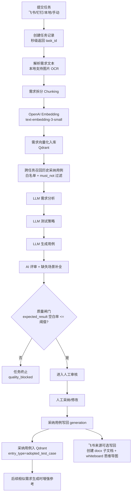

# AI Test Platform

AI 测试用例生成平台：支持飞书/钉钉文档、本地文件（含图片 OCR）、手动输入，完成需求分析 → 用例生成 → 用例评审 → 人工采纳 → 经验沉淀（向量库）全流程。

## 本次版本改动总览（2026-04-22）

> 主题：**RAG 知识库重构 + AI 用例生成质量大幅提升**。一次性解决"用例数量太少 / 模块名乱 / 跨业务领域污染"三大顽疾。

### 一、修复：跨业务领域污染（"投放分剧"出现"展示位/子展示位/灰度池"）

| 项 | 修复前 | 修复后 |
|---|---|---|
| 向量库总条目 | 834（800+ 条不相关历史任务） | 14（仅当前任务） |
| 跨任务召回类型 | 全部（含他人原始需求文档） | **仅 `adopted_test_case` 白名单** |
| 相似度门槛 | 0.45 | **0.55（真实 embedding）/ 0.65（hash）** |
| 业务模块污染词 | 多处出现 | **0 处** |

根因：旧 RAG 用 hash 伪向量做关键词匹配，跨领域文档因关键字撞（"投放/广告/流量"）混合得分超阈值，被注入生成 prompt；同时跨任务召回别人的原始需求 chunk，意义不大反而是噪声主源。

### 二、升级：向量数据库 ChromaDB → **Qdrant + 真实 OpenAI Embedding**

| 维度 | 升级前 | 升级后 |
|---|---|---|
| 向量数据库 | ChromaDB（原型用） | **Qdrant 1.17.1**（业界 RAG 主流，Rust 内核，原生 payload filter） |
| Embedding | hash 伪向量（实际只是 BM25） | **OpenAI `text-embedding-3-small`**（1536 维真实语义） |
| 跨域过滤 | 后置 Python 循环 | **Qdrant 原生 must / must_not filter** |
| 部署形态 | 嵌入式文件 | 嵌入式（默认）/ Server（可切换 Docker / Cloud） |
| 多后端切换 | 写死 | **`VECTOR_DB_BACKEND=qdrant\|chroma`** 一键切 |

新增三层抽象：
- `backend/app/rag/vector_store.py`：`VectorStore`(ABC) + `QdrantVectorStore` + `ChromaVectorStore` + `EmbeddingService`（真实/hash 双轨自动降级）
- `backend/app/rag/knowledge_base.py`：完全重写，统一异步 + 跨域白名单
- `backend/scripts/migrate_chroma_to_qdrant.py`：一键迁移脚本，支持 `--reembed` 用真实模型重算向量

### 三、修复：测试用例数量过少（25 → 101）

| 任务 | 用例数 | 业务模块数 | AI 质量分 |
|---|---|---|---|
| 修复前 | 25（含 LLM 截断） | ~10（含"功能模块N"通用名） | — |
| 第一轮修复 | 89（69 + 补充 20） | 42 | 53 |
| **最终（Qdrant+真实 embedding）** | **101**（83 + 补充 18） | **53 个真实业务模块** | 评审通过 |

修复手段：
- `max_tokens` 自适应提升（生成 16384、评审 8192），避免 JSON 截断
- `review_test_cases` 改为**保留原用例 + 仅追加缺失场景**，禁止 LLM 整体重写（防止评审阶段截断丢用例）
- 新增 `_supplement_cases_from_review`：针对 `missing_scenarios` 单独补全 + 失败重试
- `pipeline.py` 加防退化保险：评审后用例数 < 90% 原始量则按 ID 合并而非替换
- prompt 全面重写：强制最小数量、模块命名约束、优先级 `高/中/低` 差异化

### 四、修复：前端任务详情卡死在"等待执行..."

- `TaskDetail.vue` 全部改用 `api/tasks.ts` 鉴权封装（替换裸 `axios`，避免 401 静默失败）
- SSE 失败自动降级为 3s 轮询
- UI 状态机补齐 `manual_reviewing` 分支（banner / 阶段进度 / 自动展开）
- 适配 OpenAI `gpt-5.x / o1 / o3 / o4` 等推理模型：自动改用 `max_completion_tokens`、按需省略 `temperature`

### 五、其它增强

- `prompts.py` 重构 + 新增 `DEFAULT_SUPPLEMENT_PROMPT`
- `parsers.py._derive_module` 智能从用例标题反推业务模块（兜底"功能模块N"占位）
- `.env.example` 补齐 Embedding / VectorDB / Qdrant 全部新配置
- `requirements.txt` 新增 `qdrant-client>=1.13`、`tenacity>=8.2`

### 配置切换示例（`.env`）

```env
# 向量数据库后端
VECTOR_DB_BACKEND="qdrant"            # 或 "chroma"
QDRANT_PATH="./data/qdrant_db"        # 嵌入式
# QDRANT_URL="http://localhost:6333"  # 远程 Server 模式
QDRANT_COLLECTION="test_case_kb_v3"

# Embedding（留空则降级 hash）
EMBEDDING_MODEL="text-embedding-3-small"
EMBEDDING_DIM=1536
EMBEDDING_BATCH_SIZE=32

# 跨任务召回参数
KB_SIMILARITY_THRESHOLD=0.55          # 真实 embedding 用 0.55；hash 用 0.65
KB_TOP_K=5
```

### 数据迁移命令

```bash
cd backend
# --reembed 用真实 embedding 模型重算向量（强烈推荐，旧 hash 向量没有语义）
python scripts/migrate_chroma_to_qdrant.py --reembed
```

---

## 历史改动（2026-04-10）

1. 需求文档强制入向量库（RAG 基础库）。
2. 人工评审后“采纳/修改”的最终用例也入向量库，供后续相似需求参考。
3. 无历史上下文时允许首次生成（冷启动），不会阻断。
4. 飞书写回能力升级：在需求 wiki 下创建“需求名+测试用例”子文档（`docx` 容器），并写入白板思维导图画布。
5. 本地文件上传支持图片识别（OCR）。
6. 增加质量硬闸门：`expected_result` 空白比例超阈值直接终止任务（`quality_blocked`）。
7. 任务列表默认隐藏 `quality_blocked` 任务，避免低质量结果污染列表。
8. 新增防卡死机制：向量库重操作改为 `asyncio.to_thread`，提交接口不再被单任务阻塞。
9. 命名规则统一：
   1. 飞书/钉钉：先显示“文档解析中”，解析后自动改成文档需求名。
   2. 本地上传：默认任务名为文件名。
   3. 手动输入：默认任务名为需求标题。
10. 生成页默认来源改为“飞书文档”。

## 端到端流程图



## 已修正的历史文档错误

1. 不是“无历史禁止生成”：当前是冷启动可生成，有历史则增强。
2. 飞书写回不是普通 Markdown 列表：当前是 `docx` 子文档内的 whiteboard 思维导图画布。
3. 本地上传不再仅限文本：支持图片并自动 OCR 提取需求。
4. 任务提交“卡死”不是前端按钮问题：已修复为后端非阻塞执行链路。
5. 任务命名不再是随机/时间戳拼接优先：已按来源规则统一。

## 技术栈

### 后端

- FastAPI + Uvicorn
- SQLAlchemy Async + SQLite
- **Qdrant**（默认向量库，嵌入式 / Server 双模式）；Chroma 兼容保留
- **OpenAI text-embedding-3-small**（真实 1536 维语义向量），失败自动降级 hash
- OpenAI 兼容接口（可接入 GPT-5 / Qwen / DeepSeek 等），自动适配推理模型
- Feishu CLI（`lark-cli`）+ MCP 文档接入
- PyJWT 鉴权、Loguru 日志

### 前端

- Vue 3 + TypeScript + Vite
- Element Plus + TailwindCSS

## 新手教程（从零到可用）

### 1. 环境准备

1. Python 3.13（建议与当前项目一致）。
2. Node.js 22+。
3. npm 可用。
4. 如需飞书直连：安装 `lark-cli`。

```bash
npm install -g @larksuite/cli
```

### 2. 启动后端

```bash
cd backend
python3 -m venv .venv
source .venv/bin/activate
pip install -r requirements.txt
cp .env.example .env
uvicorn app.main:app --reload --host 127.0.0.1 --port 8001
```

访问接口文档：
- [http://127.0.0.1:8001/docs](http://127.0.0.1:8001/docs)

### 3. 启动前端

```bash
cd frontend
npm install
npm run dev
```

访问前端：
- [http://127.0.0.1:5173](http://127.0.0.1:5173)

默认代理：
- 前端 `/api` → `http://127.0.0.1:8001`

### 4. 配置飞书 CLI（必须做）

```bash
lark-cli config init
lark-cli auth login --recommend
```

可选 `.env` 关键项：

```env
FEISHU_USE_CLI=true
FEISHU_CLI_BIN="lark-cli"
FEISHU_CLI_AS="user"
FEISHU_WIKI_CHILD_OBJ_TYPE="docx"
```

### 5. 首次验证

1. 打开“智能用例生成”页（默认已是“飞书文档”）。
2. 输入飞书 wiki 链接提交任务。
3. 预期：提交接口秒级返回并跳转任务详情，不再卡“正在提交”。

## 关键配置说明

### 质量闸门

```env
QUALITY_GATE_ENABLE=true
EXPECTED_RESULT_EMPTY_RATIO_THRESHOLD=0.35
```

- 含义：`expected_result` 为空比例 > 35% 时，任务直接终止并标记质量不足。

### 防卡死保护

```env
LLM_STEP_TIMEOUT_SECONDS=240
LLM_STEP_RETRIES=0
LLM_MAX_SOURCE_CHARS=32000
LLM_MAX_ANALYSIS_CHARS_FOR_STRATEGY=12000
```

- 含义：限制单步超时与超长输入，降低大文档卡住风险。

### 向量库 / Embedding（v2026-04-22）

```env
VECTOR_DB_BACKEND="qdrant"            # 或 "chroma"
QDRANT_PATH="./data/qdrant_db"        # 嵌入式（无需 Docker）
# QDRANT_URL="http://localhost:6333"  # Server 模式（生产推荐，支持 payload index）
QDRANT_COLLECTION="test_case_kb_v3"

EMBEDDING_MODEL="text-embedding-3-small"
EMBEDDING_DIM=1536
EMBEDDING_BATCH_SIZE=32

KB_SIMILARITY_THRESHOLD=0.55
KB_TOP_K=5
```

- `EMBEDDING_MODEL` 留空则降级为 hash embedding（仅原型可用，**生产不推荐**）。
- 跨任务召回**只检索 `entry_type=adopted_test_case`**（人工采纳过的用例），从根源杜绝跨业务领域噪声。
- 切换 backend 后如需迁移历史数据：`python backend/scripts/migrate_chroma_to_qdrant.py --reembed`。

## 常见问题（FAQ）

### 1）“正在提交中”一直不动

排查顺序：

1. 后端是否可访问：`http://127.0.0.1:8001/docs`。
2. 飞书 CLI 是否已登录：`lark-cli auth status`。
3. 查看后端日志是否有超时或权限错误。

已做的系统级修复：

- 向量库重操作已异步线程化，避免阻塞整个 API。

### 2）飞书写回不是思维导图

检查：

1. `FEISHU_WIKI_CHILD_OBJ_TYPE="docx"`。
2. `npx -y @larksuite/whiteboard-cli@^0.1.0` 在当前机器可执行。
3. 使用的是 wiki 链接（不是普通 docx 链接）。
4. 当前飞书账号/应用具备目标文档空间写权限。

### 3）首次没有历史，能不能生成？

可以。首次是冷启动生成；历史用例只做增强，不做硬阻断。

## 默认账号

- 账号：`admin`
- 密码：`123456`

## 建议操作

1. 每次拉取新代码后先执行后端自测：
   ```bash
   PYTHONPATH=backend pytest -q backend/tests/test_requirement_kb_generation.py backend/tests/test_mcp_doc_integration.py
   ```
2. 前端改动后执行：
   ```bash
   cd frontend && npm run build
   ```
