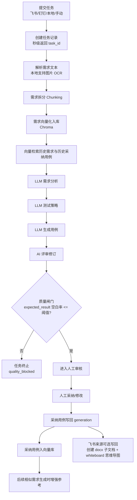

# AI Test Platform

AI 测试用例生成平台：支持飞书/钉钉文档、本地文件（含图片 OCR）、手动输入，完成需求分析 → 用例生成 → 用例评审 → 人工采纳 → 经验沉淀（向量库）全流程。

## 今日版本改动总览（2026-04-10）

1. 需求文档强制入向量库（RAG 基础库）。
2. 人工评审后“采纳/修改”的最终用例也入向量库，供后续相似需求参考。
3. 无历史上下文时允许首次生成（冷启动），不会阻断。
4. 飞书写回能力升级：在需求 wiki 下创建“需求名+测试用例”子文档（`docx` 容器），并写入白板思维导图画布。
5. 本地文件上传支持图片识别（OCR）。
6. 增加质量硬闸门：`expected_result` 空白比例超阈值直接终止任务（`quality_blocked`）。
7. 任务列表默认隐藏 `quality_blocked` 任务，避免低质量结果污染列表。
8. 新增防卡死机制：向量库重操作改为 `asyncio.to_thread`，提交接口不再被单任务阻塞。
9. 命名规则统一：
   1. 飞书/钉钉：先显示“文档解析中”，解析后自动改成文档需求名。
   2. 本地上传：默认任务名为文件名。
   3. 手动输入：默认任务名为需求标题。
10. 生成页默认来源改为“飞书文档”。

## 端到端流程图



## 已修正的历史文档错误

1. 不是“无历史禁止生成”：当前是冷启动可生成，有历史则增强。
2. 飞书写回不是普通 Markdown 列表：当前是 `docx` 子文档内的 whiteboard 思维导图画布。
3. 本地上传不再仅限文本：支持图片并自动 OCR 提取需求。
4. 任务提交“卡死”不是前端按钮问题：已修复为后端非阻塞执行链路。
5. 任务命名不再是随机/时间戳拼接优先：已按来源规则统一。

## 技术栈

### 后端

- FastAPI + Uvicorn
- SQLAlchemy Async + SQLite
- ChromaDB（向量库）
- OpenAI 兼容接口（可接入 Qwen / DeepSeek / OpenAI 等）
- Feishu CLI（`lark-cli`）+ MCP 文档接入

### 前端

- Vue 3 + TypeScript + Vite
- Element Plus + TailwindCSS

## 新手教程（从零到可用）

### 1. 环境准备

1. Python 3.13（建议与当前项目一致）。
2. Node.js 22+。
3. npm 可用。
4. 如需飞书直连：安装 `lark-cli`。

```bash
npm install -g @larksuite/cli
```

### 2. 启动后端

```bash
cd backend
python3 -m venv .venv
source .venv/bin/activate
pip install -r requirements.txt
cp .env.example .env
uvicorn app.main:app --reload --host 127.0.0.1 --port 8001
```

访问接口文档：
- [http://127.0.0.1:8001/docs](http://127.0.0.1:8001/docs)

### 3. 启动前端

```bash
cd frontend
npm install
npm run dev
```

访问前端：
- [http://127.0.0.1:5173](http://127.0.0.1:5173)

默认代理：
- 前端 `/api` → `http://127.0.0.1:8001`

### 4. 配置飞书 CLI（必须做）

```bash
lark-cli config init
lark-cli auth login --recommend
```

可选 `.env` 关键项：

```env
FEISHU_USE_CLI=true
FEISHU_CLI_BIN="lark-cli"
FEISHU_CLI_AS="user"
FEISHU_WIKI_CHILD_OBJ_TYPE="docx"
```

### 5. 首次验证

1. 打开“智能用例生成”页（默认已是“飞书文档”）。
2. 输入飞书 wiki 链接提交任务。
3. 预期：提交接口秒级返回并跳转任务详情，不再卡“正在提交”。

## 关键配置说明

### 质量闸门

```env
QUALITY_GATE_ENABLE=true
EXPECTED_RESULT_EMPTY_RATIO_THRESHOLD=0.35
```

- 含义：`expected_result` 为空比例 > 35% 时，任务直接终止并标记质量不足。

### 防卡死保护

```env
LLM_STEP_TIMEOUT_SECONDS=240
LLM_STEP_RETRIES=0
LLM_MAX_SOURCE_CHARS=32000
LLM_MAX_ANALYSIS_CHARS_FOR_STRATEGY=12000
```

- 含义：限制单步超时与超长输入，降低大文档卡住风险。

## 常见问题（FAQ）

### 1）“正在提交中”一直不动

排查顺序：

1. 后端是否可访问：`http://127.0.0.1:8001/docs`。
2. 飞书 CLI 是否已登录：`lark-cli auth status`。
3. 查看后端日志是否有超时或权限错误。

已做的系统级修复：

- 向量库重操作已异步线程化，避免阻塞整个 API。

### 2）飞书写回不是思维导图

检查：

1. `FEISHU_WIKI_CHILD_OBJ_TYPE="docx"`。
2. `npx -y @larksuite/whiteboard-cli@^0.1.0` 在当前机器可执行。
3. 使用的是 wiki 链接（不是普通 docx 链接）。
4. 当前飞书账号/应用具备目标文档空间写权限。

### 3）首次没有历史，能不能生成？

可以。首次是冷启动生成；历史用例只做增强，不做硬阻断。

## 默认账号

- 账号：`admin`
- 密码：`123456`

## 建议操作

1. 每次拉取新代码后先执行后端自测：
   ```bash
   PYTHONPATH=backend pytest -q backend/tests/test_requirement_kb_generation.py backend/tests/test_mcp_doc_integration.py
   ```
2. 前端改动后执行：
   ```bash
   cd frontend && npm run build
   ```
